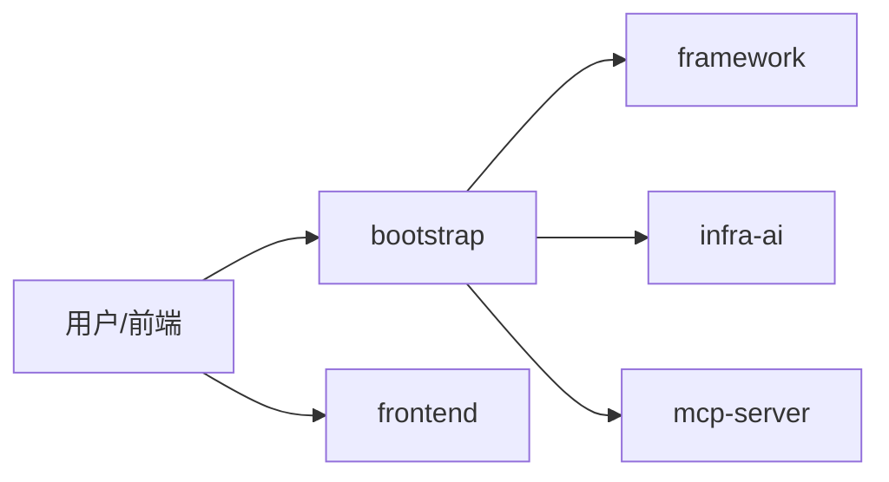
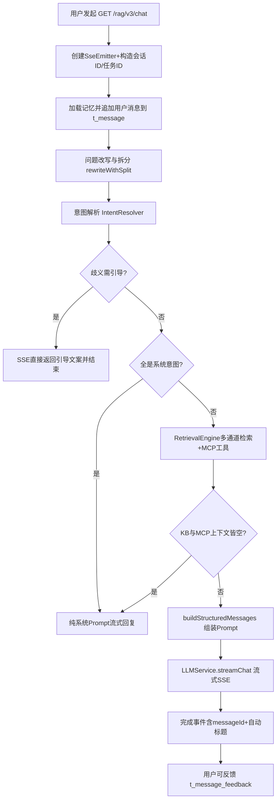
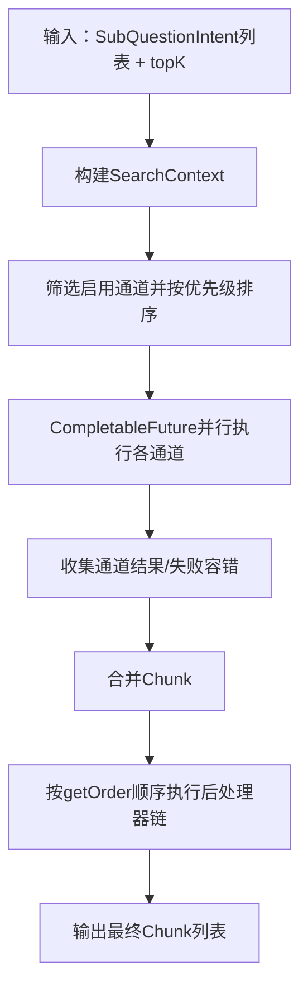
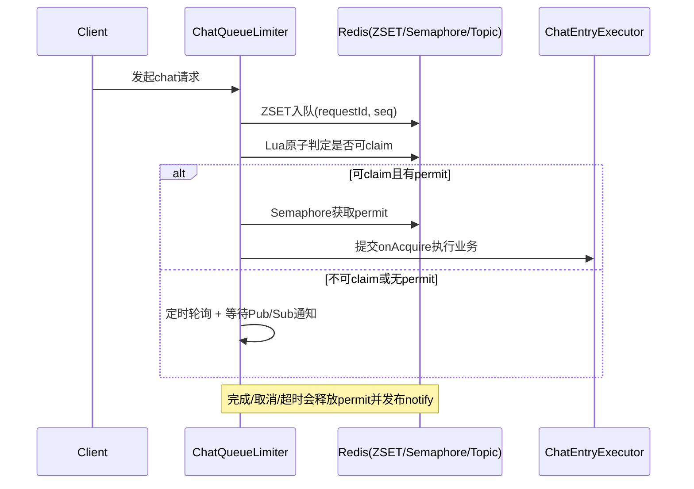
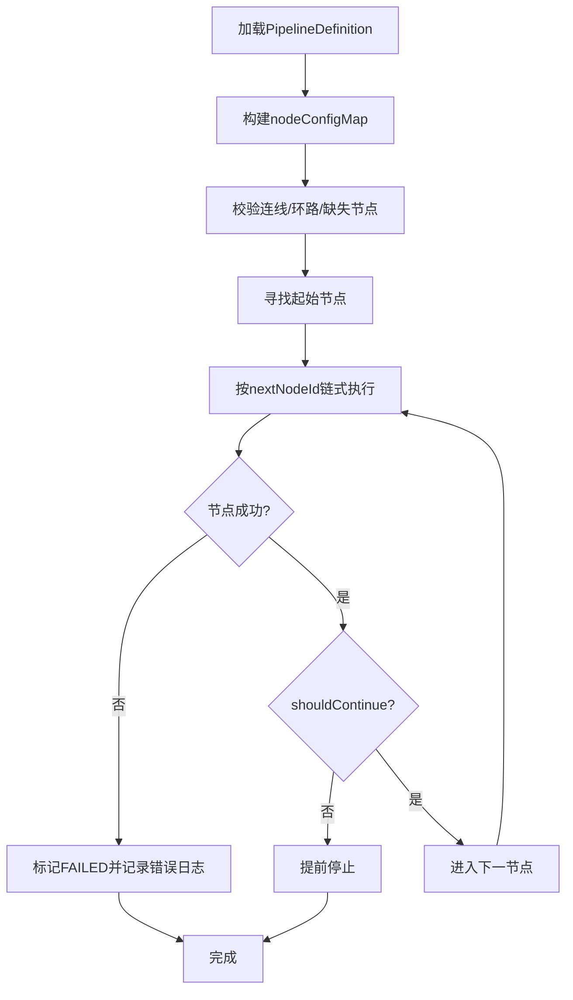
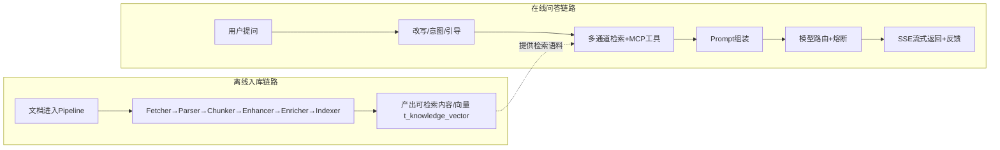

# Ragent 业务详解（超详细新手版）

> 目标读者：刚接触 RAG / 第一次看企业级 AI 项目的同学。
> 文档风格：按“业务流程 + 代码锚点 + 面试可讲”展开。
> 说明：本文把内容分成两层——**事实层（代码可证）**与**话术层（面试表达）**，避免“听起来很对、落地不准”。
> 事实基准：以 `mading/main` 分支的真实代码与 `application.yaml` 为准（本地工作区的临时改动如 6173 端口、9999 API、DuoJie 模型等一律不写入本文）。

---

## 一、项目一句话与模块地图

Ragent（RAG + Agent）是一个把“知识库检索 + 大模型生成 + 会话记忆 + 多路检索 + 意图识别 + 工具调用（MCP）+ 流式返回 + 文档入库流水线”放在同一工程里的**企业级 Agentic RAG 智能体平台**。

### 1.0 事实层（技术底座，代码可证）

- 构建：**Maven 多模块** —— `framework` / `infra-ai` / `bootstrap` / `mcp-server`。
- 语言/框架：**Java 17，Spring Boot 3.5.7**。
- 关键依赖版本：MyBatis-Plus 3.5.14（+ jsqlparser）、HikariCP、Redisson 4.0.0、RocketMQ Spring Boot Starter 2.3.5、Apache Tika 3.2.3、Hutool 5.8.37、Sa-Token 1.43.0、AWS S3 SDK 2.40.2、Milvus SDK 2.6.6、MCP SDK 1.1.2、transmittable-thread-local 2.14.5、OkHttp 4.12.0。
- 业务数据库：**PostgreSQL（启用 pgvector 扩展）+ HikariCP**，连接 `jdbc:postgresql://127.0.0.1:25432/ragent?client_encoding=UTF8`，账号 `postgres/postgres`。**不是 MySQL**（旧 MySQL 脚本已归档到 `resources/database/backups/`，不再用于主流程）。代码锚点：`bootstrap/src/main/resources/application.yaml:15-20`。
- 向量存储：可切换 `rag.vector.type = pg（默认）| milvus`；`dimension=1536`，`metric=COSINE`；Milvus 可选地址 `http://localhost:29530`。
- 缓存/分布式锁：Redis `127.0.0.1:26379`（password 123456）+ Redisson。
- 消息队列：RocketMQ `127.0.0.1:29876`。
- 对象存储：**RustFS（S3 兼容）** `http://localhost:29000`，账号 `rustfsadmin/rustfsadmin`。
- 认证：**Sa-Token**，header `Authorization`，`timeout=2592000`，`token-style=simple-uuid`；初始账号 **admin / admin（admin 角色）**。

### 1.1 端口与访问（事实层，重要更正）

| 组件 | 端口 / 路径 | 说明 |
| --- | --- | --- |
| bootstrap 主服务 | **29090**，context-path `/api/ragent` | 业务后端 |
| mcp-server | **29099** | 工具服务（JSON-RPC），**不是 9091** |
| 前端 dev（Vite） | **25173**，代理 `/api` → `http://localhost:29090` | `.env` 的 `VITE_API_BASE_URL=/api/ragent` |

代码锚点：`application.yaml:2-4`（29090 + `/api/ragent`）、`application.yaml:86-89`（`rag.mcp.servers[].url = http://localhost:29099`）。

### 1.2 模块结构（业务视角）



- `bootstrap`：业务入口与流程编排（聊天、检索、入库流程、知识库、后台管理等），业务域划分为 admin / user / rag / knowledge / ingestion / core。
- `framework`：通用能力（统一结果 `Result`/`Results`、全局异常与三级异常体系、SSE 封装 `SseEmitterSender`、用户上下文 `UserContext`/`LoginUser`、幂等 `@IdempotentSubmit`、Trace `@RagTraceNode`/`@RagTraceRoot`、雪花 ID、缓存、MQ）。所有线程池用 `TtlExecutors` 包装，跨线程透传用户上下文与 Trace。
- `infra-ai`：模型能力抽象（`ChatClient`/`EmbeddingClient`）、路由与健康熔断（`ModelSelector`/`ModelRoutingExecutor`/`ModelHealthStore`/`ModelTarget`）、配置映射 `AIModelProperties`。
- `mcp-server`：独立工具服务（`SalesMcpExecutor`/`TicketMcpExecutor`/`WeatherMcpExecutor`），JSON-RPC 端点接收并路由；bootstrap 作为 MCP 客户端调用它。
- `frontend`：React 18 + TS + Vite 5 用户问答与管理台。

---

## 二、在线问答主链路（从请求到 SSE）

这一段是你最该先吃透的主流程。

### 2.1 主链路总览



### 2.2 事实层（代码可证）

核心入口：`RAGChatServiceImpl.streamChat` 调用编排器 `StreamChatPipeline`（顺序：memory → rewrite → intent → guidance → retrieve → prompt → LLM）。

1. SSE 对话入口：`GET /rag/v3/chat`，参数 `question` / `conversationId` / `deepThinking`，返回 `SseEmitter`。
   代码：`rag/controller/RAGChatController.java`。
2. 取消任务入口：停止接口（按 taskId 终止流式输出，`StreamCancellationHandle`）。
3. 完整执行顺序（方法内真实顺序）：
   - `ConversationMemoryService.loadAndAppend(...)`：加载最近 N 轮历史 + 摘要，并把当前问题写入 **`t_message`**。
   - `QueryRewriteService.rewriteWithSplit(...)`：规范化补全 + 拆分子问题。
   - `IntentResolver.resolve(...)`：把子问题并发映射到意图树节点，过滤低置信、限制总数。
   - `IntentGuidanceService.detectAmbiguity(...)`：命中歧义则直接 SSE 返回澄清文案并结束。
   - `RetrievalEngine.retrieve(...)`（实现 `MultiChannelRetrievalEngine`）：多通道并行召回 + 后处理。
   - `RAGPromptService.buildStructuredMessages(...)`：组装结构化 Prompt。
   - `LLMService.streamChat(...)`（实现 `RoutingLLMService`）：流式输出。
4. 关键分支：
   - 歧义引导命中：直接推送引导文本并结束，不检索、不调模型。
   - 全是系统意图：走系统 Prompt 兜底流式回复（不检索、不调工具）。
   - KB + MCP 上下文全空：退回纯系统回答兜底。
5. SSE 事件拆为三类：**元数据 / 文本增量（含思考 thinking）/ 完成（含 messageId + 自动标题）**。完成后用户可对消息点赞点踩，写入 **`t_message_feedback`**。

### 2.3 15 步 RAG 完整流程（讲深讲透）

> 这是 `RAGChatServiceImpl.streamChat` / `StreamChatPipeline` 的逐步拆解，是面试与复盘的“主干”。

1. 前端用 SSE 连接 `GET /rag/v3/chat`，带 `question` / `conversationId` / `deepThinking`。
2. 后端创建 `SseEmitter`，进入 `streamChat`。
3. 生成或复用 `conversationId` + 本次 `taskId`（taskId 用于取消）。
4. `ConversationMemoryService` 加载最近 **4 轮**对话历史 + 会话摘要，并把当前问题写入 **`t_message`**。
5. `QueryRewriteService.rewriteWithSplit`：把口语化/省略的问题规范化补全，并拆成多个子问题（提升召回面与可回答率）。
6. `IntentResolver` 把每个子问题并发映射到意图树节点（`IntentClassifier`/`DefaultIntentClassifier` + `IntentTreeFactory`），过滤掉低置信节点并限制总数。
7. `IntentGuidanceService.detectAmbiguity`：若问题歧义/信息不足，直接 SSE 返回澄清引导文案并结束本次请求。
8. 若解析出的意图**全是系统意图** → 走纯系统 Prompt 回答，不检索、不调工具。
9. 否则调用 `RetrievalEngine.retrieve` → `MultiChannelRetrievalEngine`：**意图定向检索 + 全局向量兜底**两路并行 → **去重 + Rerank** → 取 Top K；若意图属于 MCP 工具类，用 LLM 按工具 schema 抽取参数，再通过 HTTP（JSON-RPC）调用 MCP Server（29099）拿工具结果。
10. 若 **KB 上下文 + MCP 上下文都为空** → 退回纯系统 Prompt 回答（兜底）。
11. 合并相关意图，构造 `IntentGroup`。
12. `RAGPromptService.buildStructuredMessages` 组装结构化 Prompt：主问题 + KB 上下文 + MCP 上下文 + 子问题 + 意图树信息 + 历史/摘要（模板来自 `PromptTemplateLoader` / `resources/prompt`）。
13. `LLMService.streamChat`（`RoutingLLMService`）按候选模型路由 + 熔断进行流式调用。
14. 流式结果拆成 SSE 事件：元数据 / 文本增量（含 thinking）/ 完成（携带 messageId + 自动生成的会话标题）。
15. 前端递增渲染；对话结束后用户可对该条 AI 消息点赞/点踩，反馈写入 **`t_message_feedback`**。

### 2.4 新手理解要点

- RAG 不是“查一下库 + 调一下模型”两步，而是**先处理问题（改写/拆分/意图/引导）再检索再生成**。
- 多个兜底分支（歧义引导、全系统意图、上下文为空）意味着：即使检索失败，系统也尽量给用户稳定反馈，而不是直接报错。

---

## 三、多通道检索：并行召回 + 后处理链

### 3.1 检索流程图



### 3.2 事实层（代码可证）

- 引擎实现：`rag/core/retrieve/MultiChannelRetrievalEngine.java`，职责 = 并行通道 + 后处理器链。
- 两条检索通道（`SearchChannel`），参数来自 `rag.search.channels`：
  - **全局向量通道** `VectorGlobalSearchChannel`：`confidence-threshold=0.6`，`top-k-multiplier=3`。
  - **意图定向通道** `IntentDirectedSearchChannel`：`min-intent-score=0.4`，`top-k-multiplier=2`。
  - 代码锚点：`application.yaml:91-98`。
- 通道筛选：`channel.isEnabled(context)` 决定是否启用，按 `getPriority()` 排序后执行。
- 并行执行：`CompletableFuture.supplyAsync(..., ragRetrievalExecutor)`；单通道异常不会打断全局，失败返回空结果与低置信对象。
- 底层检索服务 `RetrieverService` 可切换：`PgRetrieverService`（pgvector，默认）/ `MilvusRetrieverService`。
- 后处理器链 `SearchResultPostProcessor` 按 `getOrder()` 执行：`DeduplicationPostProcessor`（去重）→ `RerankPostProcessor`（重排，调用 `RoutingRerankService`）；某处理器失败会跳过并继续后续处理器。
- Embedding 候选（`ai.embedding.candidates`，按 priority）：`qwen-emb-8b`（siliconflow，`Qwen/Qwen3-Embedding-8B`，p1）、`qwen-emb-local`（ollama，p2）、`text-embedding-3-large`（aihubmix，p3）；`dimension=1536`。
- Rerank 候选（`ai.rerank.candidates`）：`qwen3-rerank`（bailian，p1）、`rerank-noop`（noop，p100，兜底）。

### 3.3 新手理解要点

- “多通道”解决召回面；“后处理”解决结果质量。
- 通道并行 + 处理链容错，体现的是工程稳定性，而不是单次理想效果。

---

## 四、意图识别与会话记忆

### 4.1 意图识别（事实层）

- 核心类：`IntentClassifier` / `DefaultIntentClassifier`、`IntentResolver`、`IntentTreeFactory`。
- 意图树持久化在 **`t_intent_node`**（**不是 `t_intent_tree_node`**），并配合 `t_query_term_mapping`（查询词映射，提升识别准确率）。
- 流程：把改写拆分后的子问题并发分类到意图树节点 → 过滤低置信（意图定向通道阈值 `min-intent-score=0.4`）→ 限制总数 → 区分“系统意图 / 检索意图 / MCP 工具意图”三类，决定后续是否检索或调工具。
- 后台可视化与维护：`IntentTreeController` + 前端 intent-tree 页面（树/列表/编辑）。

### 4.2 会话记忆与摘要（事实层）

- 核心类：`ConversationMemoryService`、`ConversationMemoryStore`（实现 `JdbcConversationMemoryStore`）。
- 配置 `rag.memory`（代码锚点 `application.yaml:65-70`，以 yaml 实际值为准）：
  - `history-keep-turns=4`：每次带入最近 4 轮对话。
  - `summary-enabled=true`：开启滚动摘要。
  - `summary-start-turns=5`：超过 5 轮开始生成/更新摘要。
  - `summary-max-chars=200`：摘要最长 200 字。
  - `title-max-length=30`：自动会话标题最长 30 字。
- 数据落库：消息明细在 **`t_message`**，会话在 `t_conversation`，摘要在 `t_conversation_summary`。

> 注意：Java 配置类 `MemoryProperties` 里的字段默认值（如 8/9/false）只是“字段缺省”，**实际运行以 `application.yaml` 的值为准**（4 轮 / 5 轮 / 开启摘要）。讲解请引用 yaml 值。

### 4.3 新手理解要点

- 意图识别是“先弄清用户到底想问哪类问题”，从而决定走检索、走工具还是直接系统回答。
- 记忆 = 短期历史（最近 4 轮）+ 长期摘要（滚动压缩），既省 token 又保留上下文。

---

## 五、模型路由与熔断：保证服务连续可用

### 5.1 路由与熔断流程

```mermaid
flowchart TD
    A[按候选模型priority遍历] --> B{client可用?}
    B -- 否 --> A
    B -- 是 --> C{allowCall(id)?}
    C -- 否 --> A
    C -- 是 --> D[尝试调用模型]
    D --> E{成功?}
    E -- 是 --> F[markSuccess并返回]
    E -- 否 --> G[markFailure并切下一个]
    G --> A
    A --> H[全失败则抛RemoteException]
```

### 5.2 事实层（代码可证）

- 路由执行器 `ModelRoutingExecutor` 按候选 priority 顺序尝试并回退；成功 `markSuccess`，失败 `markFailure`，全候选失败抛 `RemoteException`。
- 健康存储 `ModelHealthStore` 维护三态熔断器：**CLOSED → OPEN → HALF_OPEN**；OPEN 过了 `openUntil` 后允许半开探测请求。
- 选择器 `ModelSelector` + 目标 `ModelTarget` 提供候选与可用性视图。
- 熔断参数（`ai.selection`，代码锚点 `application.yaml:130-132`）：
  - `failure-threshold=2`（连续失败 2 次触发熔断）
  - `open-duration-ms=30000`（熔断打开 30 秒后进入半开探测）
- Chat 模型候选（`ai.chat.candidates`，按 priority，代码锚点 `application.yaml:137-162`）：
  - `qwen-plus`（bailian，p1）
  - `qwen3-local`（ollama，p2）
  - `qwen3-max`（bailian，supports-thinking，p3）
  - `glm-4.7`（siliconflow，`Pro/zai-org/GLM-4.7`，supports-thinking，p4）
  - `gpt-5.4`（aihubmix，p5）
  - `default-model` 与 `deep-thinking-model` 均为 **`qwen3-max`**。
- 供应商（`ai.providers`）：**ollama（本地 11434）、bailian（阿里百炼 dashscope）、aihubmix、siliconflow**。
  ❗ `mading/main` **不包含 DuoJie / 多杰**（那是本地新增，文档不写）。
- ChatClient 体系：接口 `ChatClient` + 基类 `AbstractOpenAIStyleChatClient` + 各实现 `BaiLianChatClient`/`SiliconFlowChatClient`/`AIHubMixChatClient`/`OllamaChatClient`；流式回调 `StreamCallback`、取消句柄 `StreamCancellationHandle`。

### 5.3 新手理解要点

- 熔断不是“失败就不用了”，而是“失败太多先隔离，过一会儿再试（半开探测）”。
- 目标不是永不失败，而是**局部失败不拖垮整体可用性**（自动回退到下一候选模型）。

---

## 六、MCP 工具调用：让 RAG 会“查实时数据/办业务”

### 6.1 事实层（代码可证）

- bootstrap 侧客户端：`rag/core/mcp` 下 `McpToolExecutor`、`McpToolRegistry`、`McpClientToolExecutor`，作为 **MCP 客户端**通过 HTTP（JSON-RPC）调用独立的 mcp-server。
- 服务端：`mcp-server` 模块，`McpServerApplication` 监听 **29099**；`endpoint` 接收 JSON-RPC 并路由到 `executor`：
  - `SalesMcpExecutor`（销售相关）
  - `TicketMcpExecutor`（工单相关）
  - `WeatherMcpExecutor`（天气相关）
  - `core` 定义工具元模型、请求/响应、执行器接口。
- 连接配置：`rag.mcp.servers[].url = http://localhost:29099`（`application.yaml:86-89`）。
- 调用时机：当意图被识别为 MCP 工具类时，由 LLM 按工具 schema 抽取参数，再发起 JSON-RPC 调用，结果作为 MCP 上下文拼进 Prompt。

### 6.2 新手理解要点

- MCP 把“调用外部工具/接口”标准化了：模型只管按 schema 出参数，真正执行交给独立服务，解耦且可单独扩展工具。

---

## 七、排队式限流（SSE 场景）：不是只限 QPS，而是限并发占用

### 7.1 为什么这里要“排队”

流式对话请求占用时间长（常见秒级到十几秒），若只做瞬时 QPS 限流，容易“短时放行太多、后续拥塞严重”。Ragent 的方案核心是：**先入队、再抢并发许可、完成后唤醒后续请求**。

### 7.2 排队限流流程



### 7.3 事实层（代码可证）

- 核心实现：`rag/aop/ChatQueueLimiter.java`，配合注解 `@ChatRateLimit`。
- 三大 Redisson 结构：
  - 并发许可：`RPermitExpirableSemaphore`
  - 排队：`RScoredSortedSet`（ZSET，按 seq 排序）
  - 跨实例通知：`RTopic`（Pub/Sub）
  - 并发判定用 **Lua 原子脚本** `claimIfReady(...)`，避免并发争抢乱序。
- 全局限流配置（`rag.rate-limit.global`，代码锚点 `application.yaml:57-63`，**以 yaml 实际值为准**）：
  - `enabled=true`
  - `max-concurrent=10`
  - `max-wait-seconds=15`
  - `lease-seconds=30`
  - `poll-interval-ms=200`
- 拒绝兜底：等待超时会记录会话并通过 SSE 发送 reject/done 事件，而不是无响应。

> 注意：Java 配置类 `RAGRateLimitProperties` 字段缺省值（50/20/600）只是“字段默认”，运行时以 `application.yaml` 的 10/15/30 为准，讲解请引用 yaml 值。

### 7.4 新手理解要点

- 这里不是“直接拒绝”，而是“尽量排队等待，超时再明确反馈”，对用户体验更友好。

---

## 八、可观测：Trace 全链路追踪

### 8.1 事实层（代码可证）

- framework 提供 `RagTraceContext` + 注解 `@RagTraceNode` / `@RagTraceRoot`，跨线程透传（`TtlExecutors`）。
- 配置 `rag.trace`：`enabled=true`，`max-error-length=1000`（`application.yaml:100-102`）。
- 落库：运行树写入 `t_rag_trace_run` + 节点写入 `t_rag_trace_node`；后台 `RagTraceController` + 前端 traces 页面（列表/详情）可逐节点查看耗时与错误。

### 8.2 新手理解要点

- 一次问答会被拆成多个 Trace 节点（改写、意图、检索、Prompt、LLM），出问题能精确定位卡在哪一步。

---

## 九、文档入库流水线：节点化编排执行

### 9.1 入库执行流程图



### 9.2 事实层（代码可证）

- 执行引擎：`ingestion/engine/IngestionEngine.java`；执行入口先置 `RUNNING`。
- 节点类型（`ingestion/node`，实现 `IngestionNode`）：`FetcherNode`（拉取）→ `ParserNode`（解析）→ `ChunkerNode`（切分）→ `EnhancerNode`（增强）→ `EnricherNode`（富化）→ `IndexerNode`（建索引/写向量）。
- 校验：检查环路、检查 `nextNodeId` 引用是否存在；起始节点 = **没有被任何节点引用**的节点。
- 链式执行：沿 `nextNodeId` 前进，失败即标记 `FAILED`；节点带 condition 时先评估，不满足则 skip 并记日志。
- 每节点记录日志：耗时、成功/失败、错误信息、输出摘要。
- 底层解析与切分在 `core`：`parser`（Apache Tika 解析 PDF/Office/Markdown）、`chunk`（按标题/长度/段落等切分策略）。
- 相关表：`t_ingestion_pipeline` / `t_ingestion_pipeline_node`（流水线定义）、`t_ingestion_task` / `t_ingestion_task_node`（任务执行）。
- 知识库相关表：`t_knowledge_base`、`t_knowledge_document`、`t_knowledge_chunk`、`t_knowledge_document_chunk_log`、`t_knowledge_document_schedule`、`t_knowledge_document_schedule_exec`、**`t_knowledge_vector`**（向量数据）。
- 定时刷新：`KnowledgeDocumentScheduleJob`（`@Scheduled`），配置见 `rag.knowledge.schedule`。

### 9.3 新手理解要点

- 节点化流水线的价值：可插拔、可观测、可定位——“出了问题知道卡在哪个节点”。

---

## 十、数据库与初始化（PostgreSQL + pgvector）

### 10.1 事实层：21 张表（`resources/database/schema_pg.sql`）

`t_user`、`t_conversation`、`t_conversation_summary`、**`t_message`**、**`t_message_feedback`**、`t_sample_question`、`t_knowledge_base`、`t_knowledge_document`、`t_knowledge_chunk`、`t_knowledge_document_chunk_log`、`t_knowledge_document_schedule`、`t_knowledge_document_schedule_exec`、**`t_intent_node`**、`t_query_term_mapping`、`t_rag_trace_run`、`t_rag_trace_node`、`t_ingestion_pipeline`、`t_ingestion_pipeline_node`、`t_ingestion_task`、`t_ingestion_task_node`、**`t_knowledge_vector`**。

❗ 重要更正（旧文档常错的地方）：
- 消息表是 **`t_message`**（不是 `t_conversation_message`）。
- 意图表是 **`t_intent_node`**（不是 `t_intent_tree_node`）。
- 新增 **`t_message_feedback`**（消息点赞点踩）与 **`t_knowledge_vector`**（向量数据）。
- 数据库是 **PostgreSQL + pgvector**，不是 MySQL。

### 10.2 初始化脚本（PostgreSQL，不用 mysql 命令）

- `resources/database/schema_pg.sql`（建表）
- `resources/database/init_data_pg.sql`（初始数据）
- `resources/docker/postgres/init/01-init-pgvector.sql`（创建 pgvector 扩展）
- 升级脚本：`upgrade_v1.0_to_v1.1.sql`、`upgrade_v1.1_to_v1.2.sql`
- 旧 MySQL 脚本已归档到 `resources/database/backups/`（`schema_table.sql`、`init_data.sql`），仅作历史参考。

### 10.3 Docker 编排（`resources/docker/`）

- `postgres-pgvector-stack.compose.yaml`（PostgreSQL + pgvector，含 `init/01-init-pgvector.sql`）
- `milvus-stack-2.6.6.compose.yaml`（+ `lightweight/` 下 2.5.8、2.6.6 轻量版，可选）
- `rocketmq-stack-5.2.0.compose.yaml`（+ amd 版）

---

## 十一、前端（React 18 + Vite 5）

### 11.1 事实层

- 技术栈：React 18 + TypeScript + Vite 5 + React Router 6 + Zustand + Radix UI + TailwindCSS + Axios + Recharts + react-markdown + react-virtuoso + sonner。
- dev 端口 **25173**，代理 `/api` → `http://localhost:29090`，`.env` 的 `VITE_API_BASE_URL=/api/ragent`。
- 页面 `src/pages`：`LoginPage`、`ChatPage`、`admin/*`（dashboard、knowledge 列表/文档/chunk、intent-tree 树/列表/编辑、ingestion、traces 列表/详情、settings、users、sample-questions、query-term-mapping）。
- 组件 `src/components`：`ui`（Radix 封装）、`chat`（ChatInput/MessageList/MessageItem/MarkdownRenderer/FeedbackButtons/WelcomeScreen/ThinkingIndicator）、`admin`、`layout`。
- 服务 `src/services`：`api.ts`（Axios 实例 + 拦截器，按 `code` 字段判定成功/失败，401 跳登录）、authService、chatService、sessionService、knowledgeService、dashboardService、ingestionService、ragTraceService、intentTreeService、userService、settingsService、queryTermMappingService、sampleQuestionService。
- 状态 `src/stores`：authStore、chatStore、themeStore。
- Hooks `src/hooks`：useAuth、useChat、`useStreamResponse`（SSE 流式处理）。
- 路由守卫 `src/router.tsx`：`RequireAuth`、`RequireAdmin`、`RedirectIfAuth`。

### 11.2 核心接口

- `POST /auth/login`、`POST /auth/logout`
- `GET /rag/v3/chat`（SSE 流式对话；参数 `question`、`conversationId`、`deepThinking`）+ 停止接口
- `/conversations`、`/conversations/{id}/messages`、`/conversations/messages/{id}/feedback`
- `/knowledge-base`、`/knowledge-base/{kbId}/docs/upload`、`/knowledge-base/docs/{docId}/chunk`、`/knowledge-base/docs/{docId}/chunk-logs`
- `/ingestion/tasks`、`/ingestion/tasks/{id}`
- `/admin/dashboard/{overview,performance,trends}`

---

## 十二、关键配置默认值速查（以 application.yaml 为准）

> 本节只写 **`mading/main` 的 `application.yaml` 里能直接看到的值**，避免拿 Java 字段缺省值讲错。

| 配置项 | 实际值 | 来源 |
| --- | --- | --- |
| `rag.rate-limit.global.enabled` | true | `application.yaml:57-63` |
| `rag.rate-limit.global.max-concurrent` | **10** | 同上 |
| `rag.rate-limit.global.max-wait-seconds` | **15** | 同上 |
| `rag.rate-limit.global.lease-seconds` | **30** | 同上 |
| `rag.rate-limit.global.poll-interval-ms` | 200 | 同上 |
| `rag.memory.history-keep-turns` | **4** | `application.yaml:65-70` |
| `rag.memory.summary-enabled` | **true** | 同上 |
| `rag.memory.summary-start-turns` | **5** | 同上 |
| `rag.memory.summary-max-chars` | 200 | 同上 |
| `rag.memory.title-max-length` | 30 | 同上 |
| `ai.selection.failure-threshold` | 2 | `application.yaml:130-132` |
| `ai.selection.open-duration-ms` | 30000 | 同上 |
| `rag.search.channels.vector-global.confidence-threshold` | 0.6 | `application.yaml:91-98` |
| `rag.search.channels.vector-global.top-k-multiplier` | 3 | 同上 |
| `rag.search.channels.intent-directed.min-intent-score` | 0.4 | 同上 |
| `rag.search.channels.intent-directed.top-k-multiplier` | 2 | 同上 |
| `rag.trace.enabled` / `max-error-length` | true / 1000 | `application.yaml:100-102` |
| `rag.vector.type` | pg（默认）/ milvus | 配置切换 |

### 面试安全表达模板

- 推荐说法：“默认值在 `application.yaml` 里可见（如 10 并发、4 轮记忆、熔断阈值 2），线上以部署环境配置为准。”
- 不推荐说法：“我们线上一定是某某 QPS / P99”——除非你有当前环境配置和压测报告证据。

---

## 十三、端到端业务流程（在线链路 + 入库链路一起看）



一句话：**离线链路负责“把知识准备好”，在线链路负责“把问题回答好”。**

---

## 十四、面试话术速记（话术层）

> 这部分是“表达模板”，不是新事实。请基于前文事实层作答。

### 14.1 30 秒版本

“我做的 Ragent 是企业级 Agentic RAG 平台，技术栈是 Java 17 + Spring Boot 3.5.7，多模块 + PostgreSQL/pgvector。在线链路是记忆加载、问题改写拆分、意图解析、歧义引导、多通道并行检索（外加 MCP 工具调用）、Prompt 组装，最后 SSE 流式返回。检索层是通道并行 + 后处理链（去重 + Rerank），模型层是候选路由 + 三态熔断，限流是 Redis 队列 + 信号量的排队式并发控制，入库侧是节点化 Pipeline，全链路有 Trace 可观测。”

### 14.2 2 分钟版本（问题-方案-收益）

1. **检索不稳、召回质量波动** → 多通道并行检索（全局向量 + 意图定向）+ 后处理链（去重、Rerank）→ 单通道失败不拖垮整体，质量更稳。
2. **模型供应商不稳定** → `ModelRoutingExecutor` 按 priority 顺序回退 + `ModelHealthStore` 三态熔断（阈值 2、打开 30s）→ 单模型失败自动切换。
3. **SSE 长连接高并发拥塞** → ZSET 排队 + Lua 原子 claim + Semaphore 控并发（max-concurrent=10）+ Pub/Sub 唤醒 → 从“暴力拒绝”变“可排队可反馈”。
4. **文档入库难排障** → 节点化 Pipeline + 条件执行 + 节点级日志 → 失败定位到节点级。
5. **需要实时数据/办业务** → MCP 工具调用（Sales/Ticket/Weather），LLM 按 schema 抽参，JSON-RPC 调 29099。

### 14.3 高频追问一句话回答

- 问：为什么用 PostgreSQL 而不是 MySQL？
  答：因为要做向量检索，PostgreSQL + pgvector 能把业务数据和向量放在同一库，`dimension=1536`、`COSINE`，运维更简单。
- 问：为什么不是单模型？
  答：生产单点风险高，路由 + 三态熔断是为了故障隔离与自动回退。
- 问：为什么不用简单限流直接拒绝？
  答：SSE 请求占用时长长，排队（ZSET + 信号量）比 QPS 拦截更符合体验与资源模型。
- 问：你怎么证明不是 PPT 架构？
  答：主链路在 `RAGChatServiceImpl`/`StreamChatPipeline`，检索在 `MultiChannelRetrievalEngine`，路由熔断在 `ModelRoutingExecutor`/`ModelHealthStore`，限流在 `ChatQueueLimiter`，入库在 `IngestionEngine`，都可逐行走读。

---

## 十五、源码锚点清单（复盘/面试前速查）

- 聊天入口与停止接口：`bootstrap/.../rag/controller/RAGChatController.java`
- 在线主链路编排：`bootstrap/.../rag/service/impl/RAGChatServiceImpl.java` + `StreamChatPipeline`
- 记忆/摘要：`bootstrap/.../rag/core/memory/ConversationMemoryService.java`、`JdbcConversationMemoryStore`
- 改写拆分：`bootstrap/.../rag/core/rewrite/QueryRewriteService.java`
- 意图：`bootstrap/.../rag/core/intent/{IntentResolver,DefaultIntentClassifier,IntentTreeFactory}.java`
- 引导：`bootstrap/.../rag/core/guidance/IntentGuidanceService.java`
- 多通道检索与后处理链：`bootstrap/.../rag/core/retrieve/MultiChannelRetrievalEngine.java`、`PgRetrieverService`/`MilvusRetrieverService`
- Prompt：`bootstrap/.../rag/core/prompt/{RAGPromptService,PromptTemplateLoader}.java`
- MCP 客户端：`bootstrap/.../rag/core/mcp/{McpToolExecutor,McpToolRegistry,McpClientToolExecutor}.java`
- 模型路由与熔断：`infra-ai/.../infra/model/{ModelRoutingExecutor,ModelHealthStore,ModelSelector,ModelTarget}.java`
- 路由 LLM/Embedding/Rerank：`infra-ai/.../{RoutingLLMService,RoutingEmbeddingService,RoutingRerankService}`
- 排队限流：`bootstrap/.../rag/aop/ChatQueueLimiter.java`（`@ChatRateLimit`）
- 入库流水线执行引擎：`bootstrap/.../ingestion/engine/IngestionEngine.java` + `ingestion/node/*`
- MCP 服务端：`mcp-server/.../McpServerApplication.java` + `executor/{Sales,Ticket,Weather}McpExecutor`
- 配置映射：`infra-ai/.../infra/config/AIModelProperties.java`、`bootstrap/.../rag/config/{RAGRateLimitProperties,MemoryProperties}.java`
- 配置文件与建表：`bootstrap/src/main/resources/application.yaml`、`resources/database/schema_pg.sql`

---

## 十六、本地运行（规范步骤）

1. 准备 JDK 17、Node 18+、Docker。
2. 用 `resources/docker/` 的 compose 启动 PostgreSQL(pgvector) + Redis + RocketMQ（+ 可选 Milvus）。
3. 初始化库：执行 `schema_pg.sql` + `init_data_pg.sql`（pgvector 扩展由 `01-init-pgvector.sql` 创建）。
4. 配置 `bootstrap/src/main/resources/application.yaml`（datasource=postgres、redis、rocketmq、milvus、rustfs；AI key 用环境变量 `BAILIAN_API_KEY`/`SILICONFLOW_API_KEY`/`AIHUBMIX_API_KEY`）。
5. 启动后端：`./mvnw -pl bootstrap -am spring-boot:run`（29090）；`./mvnw -pl mcp-server -am spring-boot:run`（29099）。
6. 前端：`cd frontend && npm install && npm run dev`（25173）→ 访问 `http://localhost:25173`。
7. 登录 `admin / admin`。

---

## 十七、阅读顺序建议（新手）

1. 先看 `RAGChatController`，明确接口入口（`GET /rag/v3/chat`）。
2. 再看 `RAGChatServiceImpl` / `StreamChatPipeline`，吃透 15 步主链路与分支。
3. 下钻 `MultiChannelRetrievalEngine`，理解多通道并行 + 后处理链。
4. 看意图与记忆（`IntentResolver` + `ConversationMemoryService`），理解前置处理。
5. 下钻 `ModelRoutingExecutor` + `ModelHealthStore`，理解可用性与熔断。
6. 看 `ChatQueueLimiter`，理解排队式并发治理。
7. 看 `IngestionEngine` + 节点链，补齐离线入库全景。
8. 看 `schema_pg.sql` 与 `application.yaml`，把数据与配置落到实处。

按这个顺序，你会从“会用项目”变成“能讲清项目为什么这样设计”。
