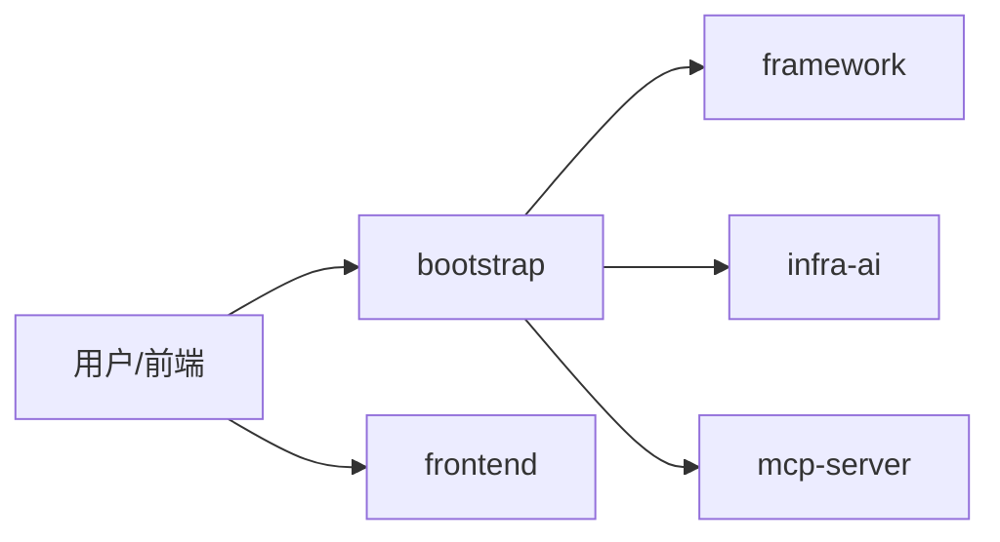
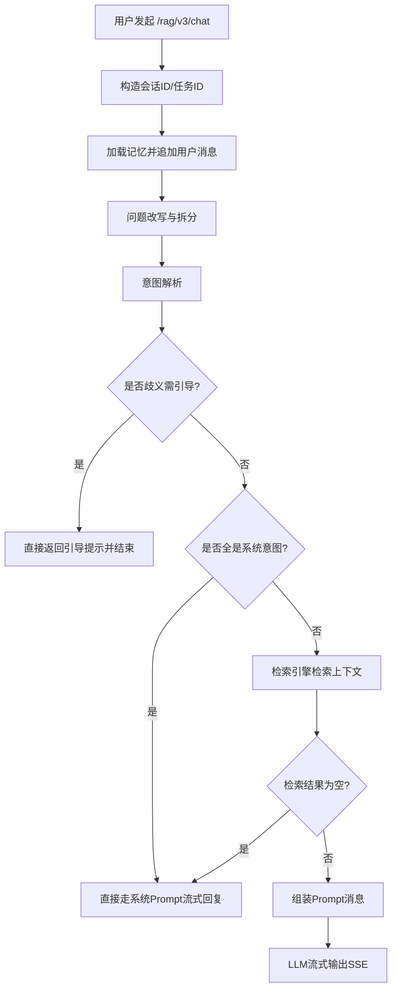
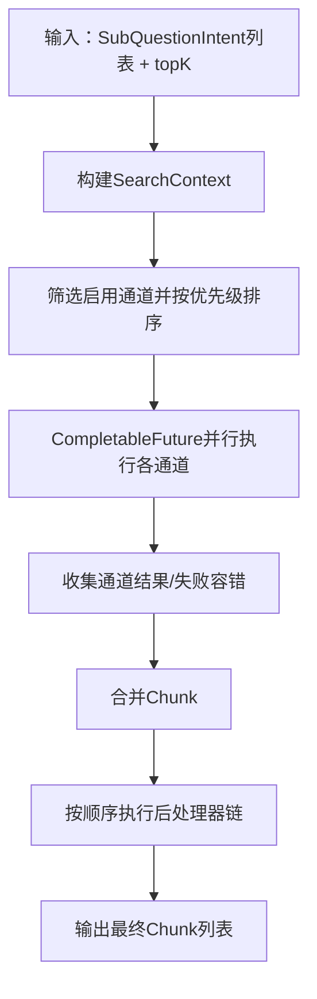
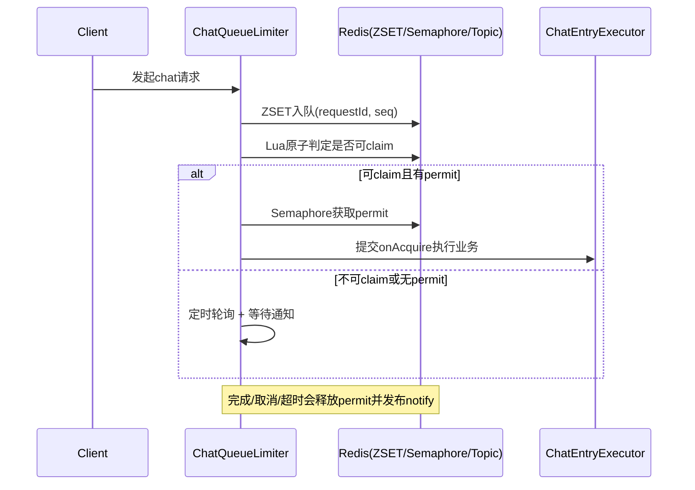
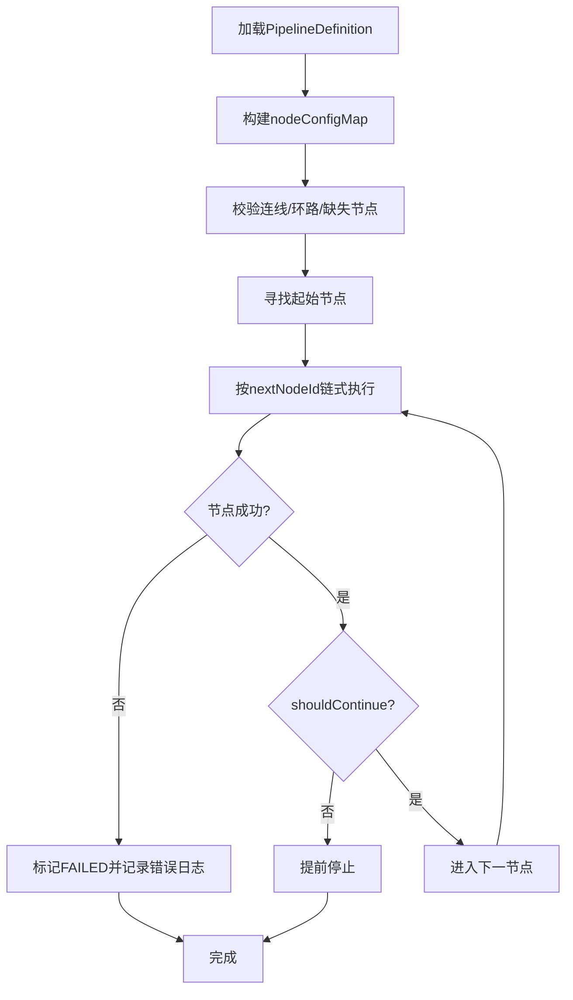
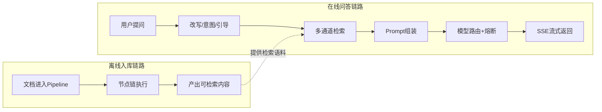

# Ragent 业务详解（超详细新手版）

> 目标读者：刚接触 RAG / 第一次看企业级 AI 项目的同学。  
> 文档风格：按“业务流程 + 代码锚点 + 面试可讲”展开。  
> 说明：本文把内容分成两层——**事实层（代码可证）**与**话术层（面试表达）**，避免“听起来很对、落地不准”。

---

## 一、项目一句话与模块地图

Ragent 是一个把“知识库检索 + 大模型生成 + 会话记忆 + 流式返回 + 文档入库流水线”放在同一工程里的企业级 RAG 智能体平台。

### 1.1 模块结构（业务视角）



- `bootstrap`：业务入口与流程编排（聊天、检索、入库流程等）
- `framework`：通用能力（上下文、trace、统一结果、幂等等）
- `infra-ai`：模型能力抽象、路由、健康状态、容错
- `mcp-server`：工具调用相关能力
- `frontend`：用户问答与管理台交互

---

## 二、在线问答主链路（从请求到 SSE）

这一段是你最该先吃透的主流程。

### 2.1 主链路总览



### 2.2 事实层（代码可证）

1. SSE 对话入口：`GET /rag/v3/chat`，返回 `SseEmitter`。  
   代码：`bootstrap/.../RAGChatController.java:48-55`

2. 取消任务入口：`POST /rag/v3/stop`。  
   代码：`bootstrap/.../RAGChatController.java:61-65`

3. 主流程注释写明链路：  
   “记忆加载 -> 改写拆分 -> 意图解析 -> 歧义引导 -> 检索(MCP+KB) -> Prompt 组装 -> 流式输出”。  
   代码：`bootstrap/.../RAGChatServiceImpl.java:59-61`

4. 核心执行顺序（方法内真实顺序）：
   - `memoryService.loadAndAppend(...)`（加载历史并追加用户问题）
   - `queryRewriteService.rewriteWithSplit(...)`
   - `intentResolver.resolve(...)`
   - `guidanceService.detectAmbiguity(...)`
   - `retrievalEngine.retrieve(...)`
   - `promptBuilder.buildStructuredMessages(...)`
   - `llmService.streamChat(...)`
   代码：`RAGChatServiceImpl.java:91-129, 153-179`

5. 两个关键分支：
   - 歧义引导命中：直接推送引导文本并结束。`RAGChatServiceImpl.java:96-101`
   - 检索为空或全系统意图：走系统 Prompt 兜底流式回复。`RAGChatServiceImpl.java:103-116, 139-151`

### 2.3 新手理解要点

- RAG 不是“查一下库 + 调一下模型”两步，而是**先处理问题再检索再生成**。
- “改写/拆分/意图/引导”是提升可回答率和正确率的关键前置层。
- 有兜底分支意味着：即使检索失败，系统也尽量给用户稳定反馈，而不是直接报错。

---

## 三、多通道检索：并行召回 + 后处理链

### 3.1 检索流程图



### 3.2 事实层（代码可证）

1. 引擎职责明确：并行通道 + 后处理器链。  
   代码：`MultiChannelRetrievalEngine.java:41-47`

2. 通道筛选逻辑：
   - `channel.isEnabled(context)` 决定是否启用
   - `getPriority()` 排序后再执行
   代码：`MultiChannelRetrievalEngine.java:85-88`

3. 并行执行方式：`CompletableFuture.supplyAsync(..., ragRetrievalExecutor)`。  
   代码：`MultiChannelRetrievalEngine.java:98-115`

4. 单通道异常不会打断全局：失败时返回空结果与低置信度对象。  
   代码：`MultiChannelRetrievalEngine.java:101-112`

5. 后处理链按 `getOrder()` 执行；某处理器失败会跳过继续后续处理器。  
   代码：`MultiChannelRetrievalEngine.java:170-173, 190-206`

### 3.3 新手理解要点

- “多通道”解决的是召回面；“后处理”解决的是结果质量。
- 通道并行 + 处理链容错，体现的是工程稳定性而不是单次理想效果。

---

## 四、模型路由与熔断：保证服务连续可用

### 4.1 路由与熔断流程

```mermaid
flowchart TD
    A[按候选模型顺序遍历] --> B{client可用?}
    B -- 否 --> A
    B -- 是 --> C{allowCall(id)?}
    C -- 否 --> A
    C -- 是 --> D[尝试调用模型]
    D --> E{成功?}
    E -- 是 --> F[markSuccess并返回]
    E -- 否 --> G[markFailure并切下一个]
    G --> A
    A --> H[全失败则抛RemoteException]
```

### 4.2 事实层（代码可证）

1. 路由执行器按候选顺序尝试并回退。  
   代码：`ModelRoutingExecutor.java:52-71`

2. 成功会 `markSuccess`，失败会 `markFailure`。  
   代码：`ModelRoutingExecutor.java:63-69`

3. 全候选失败抛出 `RemoteException`。  
   代码：`ModelRoutingExecutor.java:73-77`

4. 健康状态存在三态：`CLOSED / OPEN / HALF_OPEN`。  
   代码：`ModelHealthStore.java:136-140`

5. 熔断关键参数来自配置：
   - `failureThreshold`（失败阈值，默认 2）
   - `openDurationMs`（熔断打开时长，默认 30000ms）
   代码：`AIModelProperties.java:173-179`

6. OPEN 到 HALF_OPEN 的探测逻辑：过了 openUntil 后允许半开探测请求。  
   代码：`ModelHealthStore.java:57-64`

### 4.3 新手理解要点

- 熔断不是“失败就不用了”，而是“失败太多先隔离，过一会儿再试”。
- 目标不是永不失败，而是**局部失败不拖垮整体可用性**。

---

## 五、排队式限流（SSE 场景）：不是只限 QPS，而是限并发占用

### 5.1 为什么这里要“排队”

流式对话请求占用时间长（常见为秒级到十几秒），如果只做瞬时 QPS 限流，容易出现“短时放行太多、后续拥塞严重”。

Ragent 这套方案核心是：**先入队、再抢并发许可、完成后唤醒后续请求**。

### 5.2 排队限流流程



### 5.3 事实层（代码可证）

1. 核心结构：
   - 并发许可：`RPermitExpirableSemaphore`
   - 队列：`RScoredSortedSet`（ZSET）
   - 跨实例通知：`RTopic`（Pub/Sub）
   代码：`ChatQueueLimiter.java:37-42, 73-76`

2. 全局限流开关：`rag.rate-limit.global.enabled`（默认 true）。  
   代码：`RAGRateLimitProperties.java:34-35`

3. 默认参数（可配置）：
   - `max-concurrent` 默认 50
   - `max-wait-seconds` 默认 20
   - `lease-seconds` 默认 600
   - `poll-interval-ms` 默认 200
   代码：`RAGRateLimitProperties.java:40-59`

4. 入队与轮询：
   - `queue.add(seq, requestId)` 入队
   - `scheduleAtFixedRate` 轮询尝试
   代码：`ChatQueueLimiter.java:121-123, 188`

5. 原子认领：Lua `claimIfReady(...)`，避免并发争抢乱序。  
   代码：`ChatQueueLimiter.java:259-280, 390-396`

6. 拒绝兜底：超时会记录会话并通过 SSE 发送 reject/done 事件。  
   代码：`ChatQueueLimiter.java:167-177, 360-370`

### 5.4 新手理解要点

- 这里不是“直接拒绝”，而是“尽量排队等待，超时再明确反馈”。
- 对用户体验更友好：至少知道系统繁忙，而不是无响应。

---

## 六、文档入库流水线：节点化编排执行

### 6.1 入库执行流程图



### 6.2 事实层（代码可证）

1. 执行入口：`execute(pipeline, context)`，先置 `RUNNING`。  
   代码：`IngestionEngine.java:60-66`

2. 流水线校验：
   - 检查环路
   - 检查 nextNodeId 引用是否存在
   代码：`IngestionEngine.java:103-138`

3. 起始节点定义：**没有被任何节点引用**的节点。  
   代码：`IngestionEngine.java:141-153`

4. 链式执行方式：沿 `nextNodeId` 前进，失败即标记 `FAILED`。  
   代码：`IngestionEngine.java:158-199, 182-186`

5. 条件执行：节点配置带 condition 时先评估，不满足则 skip 并记日志。  
   代码：`IngestionEngine.java:215-227`

6. 每节点记录日志：耗时、成功/失败、错误信息、输出摘要。  
   代码：`IngestionEngine.java:236-258`

### 6.3 新手理解要点

- 节点化流水线的价值：可插拔、可观测、可定位。
- 业务上最关键是“出了问题知道卡在哪个节点”，而不是“理论上可扩展”。

---

## 七、关键配置与“默认值”怎么讲才安全

> 本节只写**代码里能直接看到的默认值**，避免讲错。

### 7.1 可直接引用的默认值

1. 全局排队限流（`rag.rate-limit.global.*`）默认：
   - enabled=true
   - max-concurrent=50
   - max-wait-seconds=20
   - lease-seconds=600
   - poll-interval-ms=200
   来源：`RAGRateLimitProperties.java:34-59`

2. 模型熔断策略（`ai.selection.*`）默认：
   - failureThreshold=2
   - openDurationMs=30000
   来源：`AIModelProperties.java:173-179`

3. 记忆配置（`rag.memory.*`）默认：
   - historyKeepTurns=8
   - ttlMinutes=60
   - summaryEnabled=false
   - summaryStartTurns=9
   - summaryMaxChars=200
   - titleMaxLength=30
   来源：`MemoryProperties.java:45-75`

### 7.2 面试安全表达模板

- 推荐说法：  
  “默认值在配置类里可见，但线上以部署环境配置为准，我会先说明**默认值**再说明**可动态调整**。”

- 不推荐说法：  
  “我们线上一定是 10 并发/0.6 阈值/P99 多少”——除非你有当前环境配置和压测报告证据。

---

## 八、端到端业务流程（把在线链路和入库链路放一起看）



一句话：**离线链路负责“把知识准备好”，在线链路负责“把问题回答好”。**

---

## 九、面试话术速记

> 这部分是“表达模板”，不是新事实。请基于前文事实层作答。

### 9.1 30 秒版本

“我做的 Ragent 是企业级 RAG 平台。在线链路是记忆加载、问题改写拆分、意图解析、歧义引导、多通道并行检索、Prompt 组装、最后 SSE 流式返回。检索层采用通道并行 + 后处理链，模型层采用候选路由 + 三态熔断，限流是 Redis 队列 + 信号量的排队式并发控制。入库侧是节点化 Pipeline，支持条件执行和节点级日志定位。”

### 9.2 2 分钟版本（问题-方案-收益）

1. **问题一：检索不稳，召回质量波动**  
   方案：多通道并行检索 + 后处理链（排序、去重、精炼）。  
   收益：单通道失败不拖垮整体，结果质量更稳定。

2. **问题二：模型供应商不稳定**  
   方案：ModelRoutingExecutor 顺序回退 + ModelHealthStore 三态熔断。  
   收益：单模型失败可自动切换，服务可用性更好。

3. **问题三：SSE 长连接高并发下容易拥塞**  
   方案：ZSET 排队 + Lua 原子 claim + Semaphore 控并发 + Pub/Sub 唤醒。  
   收益：从“暴力拒绝”变成“可排队可反馈”。

4. **问题四：文档入库难排障**  
   方案：节点化 Pipeline + 条件执行 + 节点日志。  
   收益：失败能定位到节点级，运维与迭代效率更高。

### 9.3 高频追问一句话回答

- 问：为什么不是单模型？  
  答：生产里单点风险高，路由+熔断是为了故障隔离和自动回退。

- 问：为什么不用简单限流直接拒绝？  
  答：SSE 请求占用时长长，排队机制比 QPS 拦截更符合体验和资源模型。

- 问：你怎么证明不是 PPT 架构？  
  答：核心链路在 `RAGChatServiceImpl`，检索在 `MultiChannelRetrievalEngine`，路由熔断在 `ModelRoutingExecutor/ModelHealthStore`，限流在 `ChatQueueLimiter`，入库在 `IngestionEngine`，都可逐行走读。

---

## 十、源码锚点清单（复盘/面试前速查）

- 聊天入口与停止接口：  
  `bootstrap/src/main/java/com/nageoffer/ai/ragent/rag/controller/RAGChatController.java`

- 在线主链路编排：  
  `bootstrap/src/main/java/com/nageoffer/ai/ragent/rag/service/impl/RAGChatServiceImpl.java`

- 多通道检索与后处理链：  
  `bootstrap/src/main/java/com/nageoffer/ai/ragent/rag/core/retrieve/MultiChannelRetrievalEngine.java`

- 模型路由与熔断：  
  `infra-ai/src/main/java/com/nageoffer/ai/ragent/infra/model/ModelRoutingExecutor.java`  
  `infra-ai/src/main/java/com/nageoffer/ai/ragent/infra/model/ModelHealthStore.java`

- 排队限流：  
  `bootstrap/src/main/java/com/nageoffer/ai/ragent/rag/aop/ChatQueueLimiter.java`

- 入库流水线执行引擎：  
  `bootstrap/src/main/java/com/nageoffer/ai/ragent/ingestion/engine/IngestionEngine.java`

- 关键配置默认值：  
  `bootstrap/src/main/java/com/nageoffer/ai/ragent/rag/config/RAGRateLimitProperties.java`  
  `bootstrap/src/main/java/com/nageoffer/ai/ragent/rag/config/MemoryProperties.java`  
  `infra-ai/src/main/java/com/nageoffer/ai/ragent/infra/config/AIModelProperties.java`

---

## 十一、阅读顺序建议（新手）

1. 先看 `RAGChatController`，明确接口入口。  
2. 再看 `RAGChatServiceImpl`，吃透主链路分支。  
3. 下钻 `MultiChannelRetrievalEngine`，理解并行 + 后处理。  
4. 下钻 `ModelRoutingExecutor + ModelHealthStore`，理解可用性。  
5. 看 `ChatQueueLimiter`，理解并发治理。  
6. 看 `IngestionEngine`，补齐离线入库全景。

按这个顺序，你会从“会用项目”变成“能讲清项目为什么这样设计”。
